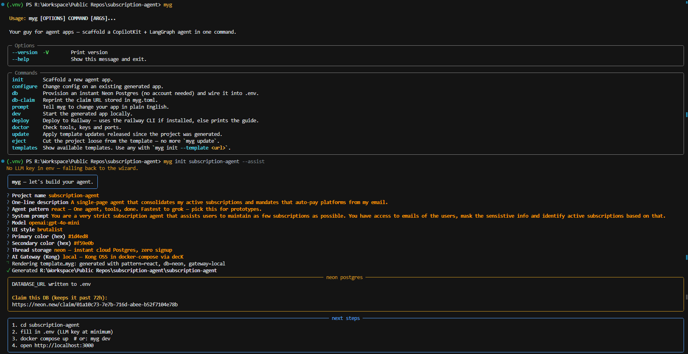
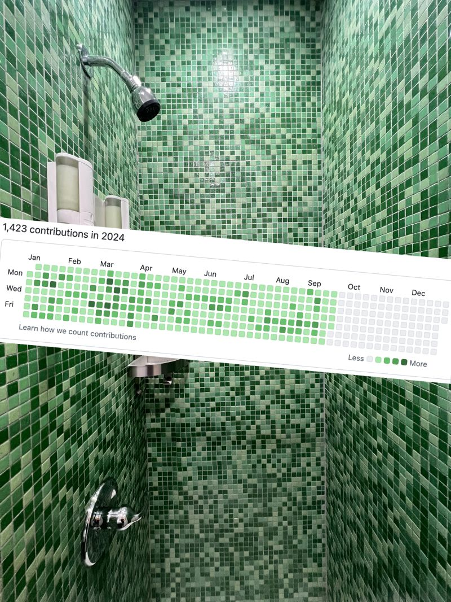

<p align="center">
  
</p>

<h1 align="center">myg</h1>

<p align="center">
  <b>Your guy for agent apps.</b>
</p>

<p align="center">
  <a href="https://pypi.org/project/myg/"></a>
  <a href="https://www.npmjs.com/package/create-myg"></a>
  <a href="https://github.com/control-shift-escape-co/myguy/actions/workflows/ci.yml"></a>
  <a href="LICENSE"></a>
</p>

One command in, and you're holding a single-page agent app: Next.js + CopilotKit
up front, FastAPI + LangGraph in the back, threads that actually persist, and an
optional Kong AI Gateway sitting on your LLM traffic like it owns the place —
because it does. Docker Compose for your laptop, Railway for the cloud. No
glue-code archaeology required.

## First things first: credentials

Nobody reads a README top to bottom, so the creds go up top:

| Credential | When you need it | Notes |
| --- | --- | --- |
| `OPENAI_API_KEY` / `ANTHROPIC_API_KEY` / `GEMINI_API_KEY` | **Always** — one key for your chosen model | goes in `.env` |
| `DATABASE_URL` | Thread persistence | **zero signup** — `myg db` provisions instant Neon Postgres + gives you a claim link |
| `KONNECT_TOKEN` | Only if `gateway=konnect` | Kong Konnect PAT — `gateway=local` needs nothing |
| `COPILOTKIT_PUBLIC_API_KEY` | Only for CopilotKit cloud/Intelligence | self-hosted runtime needs nothing |
| `ANTHROPIC_API_KEY` (or `DEVIN_API_KEY`) | Only for `myg prompt` | the agentic-edit command |
| `RAILWAY_TOKEN` | Only for `myg deploy` | or just use the Railway dashboard |
| Docker | Only for `docker compose up` | `myg dev` runs natively too |

## Get an app in ~60 seconds

```bash
uvx myg init          # or: pipx run myg init | npm create myg | pip install myg && myg init
```

<p align="center">
  
</p>

Answer a few questions (or don't — `myg init --yes` picks sane defaults,
`myg init --assist` lets an LLM pick for you, `--github-style <repo-url>` steals
the vibe of a site you like). Out comes:

- `apps/web` — Next.js + CopilotKit chat UI, themed by your colors
- `apps/agent` — FastAPI + LangGraph over AG-UI, your chosen pattern
- Postgres threads — Neon (instant, no account), Docker, or SQLite
- `docker-compose.yml` + `RAILWAY.md` + `myg.toml` + Kong config if you said yes

## Pick your fighter: agent patterns

| Pattern | What it is |
| --- | --- |
| `react` | One agent, some tools, clean loop. Prototype king. |
| `plan_execute` | Plans steps, executes them, replans. For long tasks. |
| `supervisor` | A boss agent delegating to subagents-as-tools. |
| `swarm` | Agents handing the convo off to each other mid-chat. |
| `rag` | Agent with a `search_knowledge_base` tool over your `knowledge/` docs. |
| `hitl` | Pauses for human approval before risky tool calls. |
| `evaluator_optimizer` | Generate → grade → revise loop until the draft passes. |

All served over [AG-UI](https://github.com/ag-ui-protocol/ag-ui) and checkpointed
with `langgraph-checkpoint-postgres`, so threads survive restarts.

## Commands

| Command | Does what |
| --- | --- |
| `myg init` | Wizard → template render → instant Neon DB → next steps |
| `myg configure` | Edit `myg.toml` + re-render (`--set`, `--ai`, `--github-style`) |
| `myg prompt "make it sexy"` | Agentic edits to your existing app |
| `myg dev` | `docker compose up`, or native uv + node if docker's missing |
| `myg db` | Provisions instant Neon Postgres + prints the claim link |
| `myg deploy` | Railway, via CLI or a guided checklist |
| `myg doctor` | Checks your env before things go sideways |
| `myg update` | Pulls template upgrades into your app (cruft) |
| `myg eject` | Cuts the template link — the app is all yours |
| `myg templates` | Built-in + community template registry |

## Why another scaffolder?

`npx copilotkit create` gives you a starter. Google's agent-starter-pack is
GCP-shaped. myg is the one with **the gateway** — Kong AI Gateway (local decK or
Konnect) in front of every LLM call: auth, rate limits, observability, one
endpoint for any provider. That's the whole flex.

## Contributing

You. Yes, you. myg is open source (MIT) and built to be contributed to —
`CONTRIBUTING.md` has the setup. Every contributor gets immortalized below with
their GitHub handle, so if yours is boring, consider this motivation to make it
funky.

### The wall

- **[@AbhiAva](https://github.com/AbhiAva)** — first guy. Fist bumps mandatory.
- *your name here* — the wall has room.

<p align="center">
  <b>doing it for the tiles tbh</b><br/>
  
</p>

## Roadmap

- [x] Issue-triaging bugbot — `.github/workflows/triage.yml` fires a Devin
  session on every new issue (set the `DEVIN_API_KEY` secret)
- [x] More patterns: `rag`, `hitl`, `evaluator_optimizer` join the original four
- [x] `myg eject` — graduate from the template cleanly
- [x] Community template registry — `myg templates --community`; add yours via
  one JSON line in `template/templates-registry.json`
- [ ] Real tests on generated apps (the render smoke + unit suite cover the CLI;
  the apps themselves still deserve e2e runs)

## License

MIT — go build something unhinged (responsibly).

<p align="center">
  
</p>

